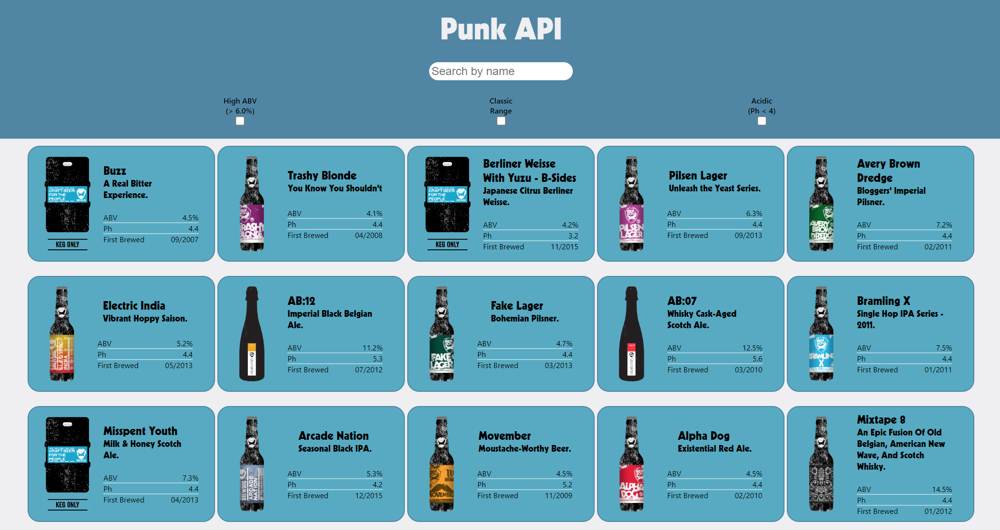

# Punk API

Punk API is the final JavaScript project in the _nology consultancy course.

## The Brief

Build a website using React and the Punk API based upon the requirements below:

- Render a list of elements displaying information retrieved from the Punk API
- Make the elements searchable by name
- Use three pre-defined filter conditions to filter the elements further
- Style the site to your taste
- Use React Testing Library to test where appropriate
- Host the project in a repository on GitHub